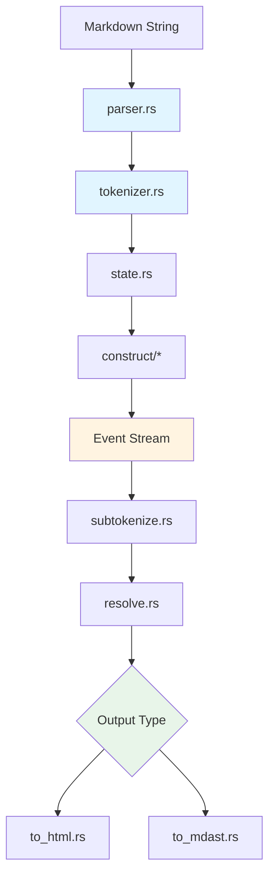
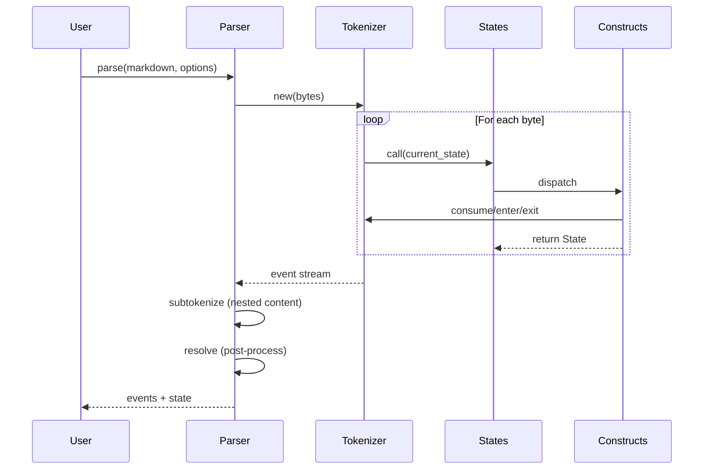
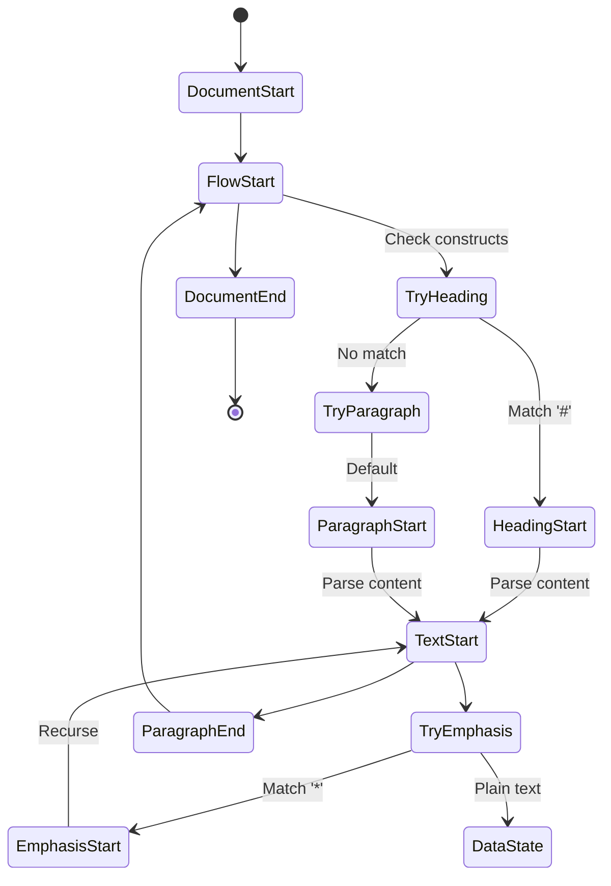
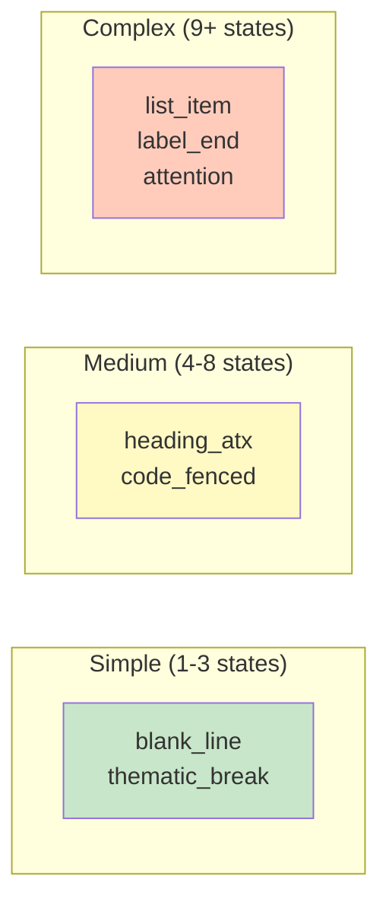
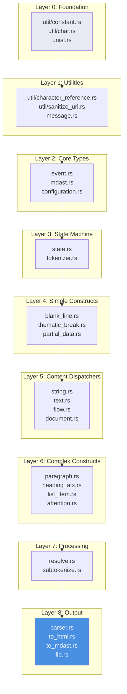
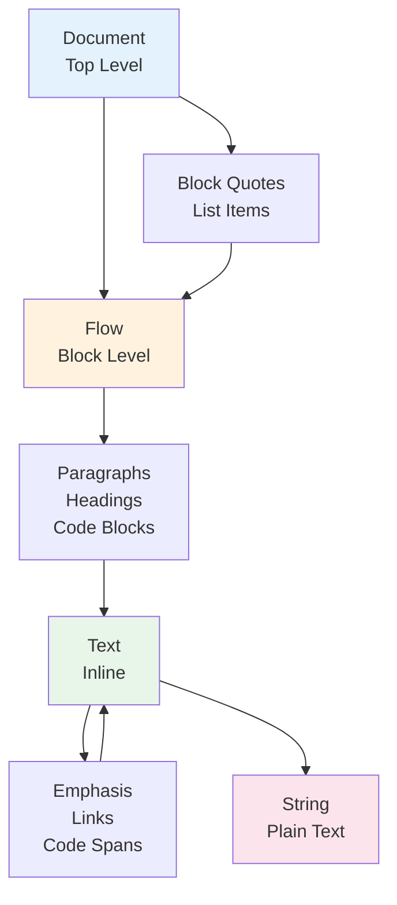
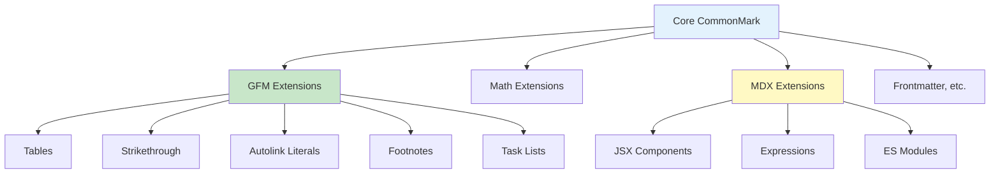
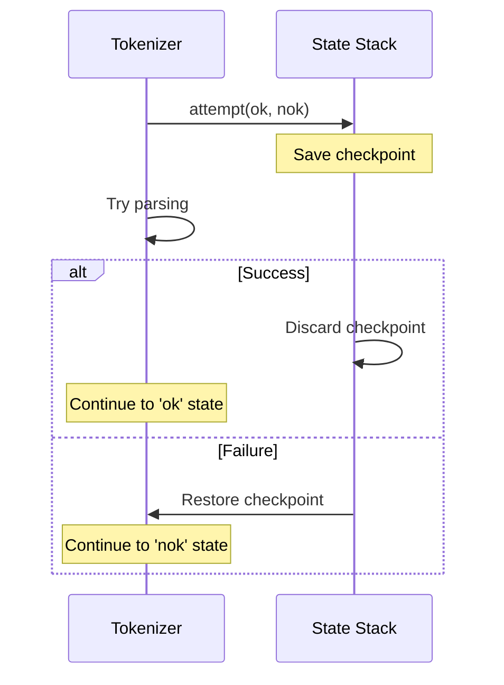
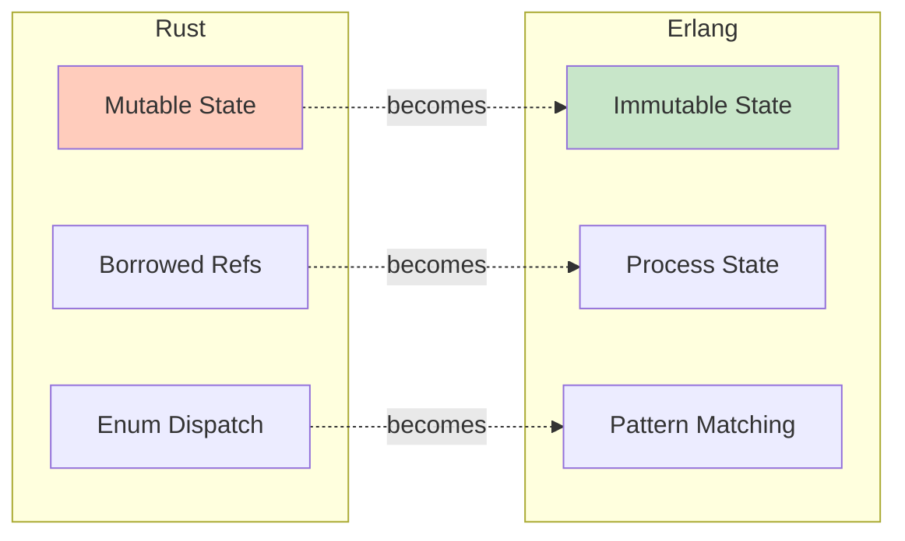
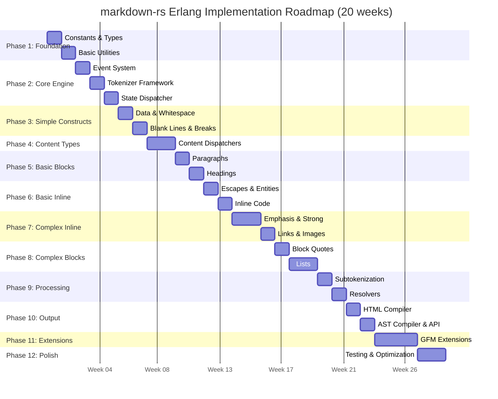

# Erlang `erlmd` Library Rewrite

> **Purpose**: Comprehensive architectural analysis to guide phased Erlang implementation of the markdown-rs parser

**Analysis Date**: November 12, 2025
**Source**: markdown-rs Rust codebase (extracted metadata)
**Target**: Erlang/OTP implementation planning

---

## Table of Contents

1. [Executive Summary](#1-executive-summary)
2. [Core Data Structures](#2-core-data-structures)
3. [Module Architecture](#3-module-architecture)
4. [Parsing Flow Architecture](#4-parsing-flow-architecture)
5. [The Construct System](#5-the-construct-system)
6. [Module Dependencies & Build Layers](#6-module-dependencies--build-layers)
7. [Key Function Signatures](#7-key-function-signatures)
8. [Content Type System](#8-content-type-system)
9. [Extension Points](#9-extension-points)
10. [Critical Algorithms](#10-critical-algorithms)
11. [Implementation Implications for Erlang](#11-implementation-implications-for-erlang)
12. [Implmenetation Phases](#12-implmenetation-phases)
13. [Appendix & Quick Start](#13-appendix--quick-start)
14. [Conclusion](#14-conclusion)

---

## 1. Executive Summary

### What is markdown-rs?

**markdown-rs** is a CommonMark-compliant markdown parser written in Rust that:

- Transforms markdown text into HTML or an abstract syntax tree (mdast)
- Uses a **state machine tokenizer** that generates events
- Supports extensions (GFM, MDX, math, frontmatter)
- Processes content hierarchically through different **content types**

### Core Architecture Pattern



### Key Insight for Erlang

The architecture is **event-driven** and **layered by content type**. The parser doesn't build an AST directly—it generates a flat stream of events that are later processed into output formats. This is ideal for Erlang's pattern matching and process-based concurrency.

### Complete Architecture Overview

```mermaid
graph TB
    subgraph "Input Layer"
        MD[Markdown String<br/>"# Hello **world**"]
    end

    subgraph "Public API (lib.erl)"
        API1[to_html/1]
        API2[to_html_with_options/2]
        API3[to_mdast/2]
    end

    subgraph "Parse Layer (parser.erl)"
        Parse[parse/2<br/>Orchestrates everything]
    end

    subgraph "Core State Machine"
        Tokenizer[tokenizer.erl<br/>State Machine Driver<br/>• consume/1<br/>• enter/2, exit/2<br/>• attempt/3]
        State[state.erl<br/>Dispatcher<br/>• call/2<br/>Maps names to functions]
    end

    subgraph "Constructs (40+ modules)"
        direction TB
        ContentDisp[Content Dispatchers<br/>document, flow, text, string]
        SimpleC[Simple Constructs<br/>blank_line, thematic_break]
        BlockC[Block Constructs<br/>paragraph, heading_atx,<br/>block_quote, list_item]
        InlineC[Inline Constructs<br/>emphasis, link, code_text,<br/>character_escape]
    end

    subgraph "Processing Layer"
        Subtoken[subtokenize.erl<br/>Handle Nested Content<br/>Recursive parsing]
        Resolve[resolve.erl<br/>Post-Process Events<br/>Match delimiters]
    end

    subgraph "Event Stream"
        Events["[Enter(Heading), Enter(Text),<br/>Enter(Data), Exit(Data),<br/>Enter(Strong), ...]<br/><br/>Flat list of events"]
    end

    subgraph "Output Layer"
        HTML[to_html.erl<br/>Events → HTML]
        AST[to_mdast.erl<br/>Events → AST]
    end

    subgraph "Utilities"
        Utils[util/*<br/>character_reference<br/>sanitize_uri<br/>encode<br/>normalize_identifier]
    end

    subgraph "Output"
        Out1["&lt;h1&gt;Hello &lt;strong&gt;world&lt;/strong&gt;&lt;/h1&gt;"]
        Out2[AST Node Tree]
    end

    MD --> API1 & API2 & API3
    API1 & API2 --> Parse
    API3 --> Parse

    Parse --> Tokenizer
    Tokenizer --> State
    State --> ContentDisp
    ContentDisp --> SimpleC & BlockC & InlineC
    SimpleC & BlockC & InlineC --> Tokenizer

    Tokenizer --> Events
    Events --> Subtoken
    Subtoken --> Resolve
    Resolve --> Events

    Parse --> HTML
    Parse --> AST
    Events --> HTML
    Events --> AST

    HTML --> Out1
    AST --> Out2

    Utils -.-> HTML
    Utils -.-> AST
    Utils -.-> Tokenizer

    style MD fill:#e3f2fd
    style Events fill:#fff4e1
    style API1 fill:#4a90e2,color:#fff
    style API2 fill:#4a90e2,color:#fff
    style API3 fill:#4a90e2,color:#fff
    style Out1 fill:#e8f5e9
    style Out2 fill:#e8f5e9
    style Tokenizer fill:#ffccbc
    style State fill:#ffccbc


```

## 2. Core Data Structures

### Event - The Fundamental Unit

Events represent semantic spans in markdown. They're the core communication unit:

```rust
pub struct Event {
    pub kind: Kind,        // Enter or Exit
    pub name: Name,        // Semantic label (Paragraph, Heading, etc.)
    pub point: Point,      // Source position
    pub link: Option<Link>, // Connection to nested content
    pub content: Option<Content>, // Content type
}
```

**Key Pattern**: Events come in Enter/Exit pairs (like XML tags).

**Erlang Translation**:

```erlang
-record(event, {
    kind :: enter | exit,
    name :: atom(),
    point :: point(),
    link = undefined :: link() | undefined,
    content = undefined :: content_type() | undefined
}).
```

### Point & Position - Location Tracking

```rust
pub struct Point {
    pub line: usize,    // 1-indexed
    pub column: usize,  // 1-indexed
    pub offset: usize,  // 0-indexed byte position
}

pub struct Position {
    pub start: Point,
    pub end: Point,
}
```

### State - Control Flow

```rust
pub enum State {
    Next(Name),     // Continue to named state
    Retry(Name),    // Retry without consuming
    Ok,             // Success
    Nok,            // Failure
    Error(Message), // Fatal error
}
```

### Tokenizer - The State Machine Driver

The central struct that:

- Manages state transitions
- Generates events
- Handles backtracking (attempts)
- Tracks position (line, column, offset)

**Critical Methods**:

- `consume()` - Process one byte
- `enter()` / `exit()` - Create event pairs
- `attempt()` - Try parsing with rollback on failure

### ParseState - Global Context

```rust
pub struct ParseState<'a> {
    pub bytes: &'a [u8],
    pub options: &'a ParseOptions,
    pub definitions: Vec<String>,
    pub gfm_footnote_definitions: Vec<String>,
}
```

## 3. Module Architecture

### High-Level Module Organization

```mermaid
graph TB
    subgraph "Public API"
        Lib[lib.rs]
    end

    subgraph "Core Engine"
        Parser[parser.rs]
        Tokenizer[tokenizer.rs]
        State[state.rs]
    end

    subgraph "Constructs"
        Document[document.rs]
        Flow[flow.rs]
        Text[text.rs]
        Constructs[40+ construct files]
    end

    subgraph "Processing"
        Subtokenize[subtokenize.rs]
        Resolve[resolve.rs]
    end

    subgraph "Output"
        ToHTML[to_html.rs]
        ToMdast[to_mdast.rs]
    end

    Lib --> Parser
    Parser --> Tokenizer
    Tokenizer --> State
    State --> Constructs
    Parser --> Subtokenize
    Subtokenize --> Resolve
    Parser --> ToHTML
    Parser --> ToMdast

    style Lib fill:#4a90e2,color:#fff
    style Parser fill:#e1f5ff
    style ToHTML fill:#e8f5e9
```

### Module Responsibility Matrix

| Module | Responsibility | Key Exports |
|--------|---------------|-------------|
| **lib.rs** | Public API | `to_html()`, `to_mdast()` |
| **parser.rs** | Parse orchestration | `parse()`, `ParseState` |
| **tokenizer.rs** | State machine driver | `Tokenizer` struct |
| **state.rs** | State dispatcher | `State` enum, `call()` |
| **event.rs** | Event types | `Event`, `Kind`, `Name` |
| **subtokenize.rs** | Nested content | `subtokenize()` |
| **resolve.rs** | Event resolution | Resolver functions |
| **to_html.rs** | HTML generation | `compile()` |
| **to_mdast.rs** | AST generation | `compile()` |
| **construct/*** | Markdown elements | Individual parsers |
| **util/*** | Utilities | Encoding, sanitization, etc. |

### Construct Organization

**Entry Points (Content Dispatchers)**:

- `document.rs` - Top-level
- `flow.rs` - Block-level (paragraphs, headings, etc.)
- `text.rs` - Inline (emphasis, links, etc.)
- `string.rs` - Plain strings (in code, URLs)

**40+ Construct Files**:

- Block: `paragraph.rs`, `heading_atx.rs`, `block_quote.rs`, `list_item.rs`, `code_fenced.rs`, etc.
- Inline: `attention.rs`, `label_end.rs`, `autolink.rs`, `character_escape.rs`, etc.
- GFM: `gfm_table.rs`, `gfm_strikethrough.rs`, `gfm_footnote_definition.rs`, etc.
- MDX: `mdx_jsx_flow.rs`, `mdx_expression_text.rs`, etc.

## 4. Parsing Flow Architecture

### The State Machine Flow



### State Transitions



### Key Algorithmic Patterns

1. **Byte-by-byte Processing**: State machine consumes one byte at a time
2. **Attempt/Backtracking**: Try parsing, revert on failure
3. **Content Type Nesting**: Document → Flow → Text → String
4. **Event Streaming**: Generate flat event list, not tree
5. **Post-Processing**: Resolve and subtokenize after initial parse

## 5. The Construct System

### What is a Construct?

A construct is a markdown element type (paragraph, heading, link, etc.). Each construct:

- Has multiple state functions
- Follows standard interface: `pub fn start(tokenizer: &mut Tokenizer) -> State`
- May have a resolver for post-processing

### Construct Pattern

```rust
// Entry point
pub fn start(tokenizer: &mut Tokenizer) -> State {
    if matches_pattern(tokenizer) {
        tokenizer.enter(EventName);
        State::Next(Name::ConstructInside)
    } else {
        State::Nok // Try next construct
    }
}

// Internal states
fn inside(tokenizer: &mut Tokenizer) -> State {
    match tokenizer.current {
        Some(byte) => {
            tokenizer.consume();
            State::Next(Name::ConstructAfter)
        }
        _ => State::Nok
    }
}

fn after(tokenizer: &mut Tokenizer) -> State {
    tokenizer.exit(EventName);
    State::Ok // Success
}
```

### Complexity Levels



### Example: Simple Construct (Thematic Break)

Parses `---`, `***`, or `___` as horizontal rules.

**States**: start → inside → after (3 states, ~40 lines)

**Logic**:

1. Check for `*`, `-`, or `_`
2. Count characters (need 3+)
3. Allow spaces between
4. Must end at line ending

### Example: Complex Construct (Link/Image End)

Parses `](url "title")` part of links.

**Why Complex**:

- Must match with previous `[`
- Multiple formats: inline `](url)`, reference `][ref]`, shortcut `]`
- URL validation and escaping
- Interacts with label tracking system

**States**: 15+ states, 300+ lines of code

### Construct Discovery

Constructs are called by content type dispatchers in priority order:

```rust
// In flow.rs
pub fn start(tokenizer: &mut Tokenizer) -> State {
    // Try thematic break first (high priority)
    if constructs.thematic_break {
        tokenizer.attempt(Ok, AfterThematicBreak);
        return Retry(ThematicBreakStart);
    }

    // Then heading
    if constructs.heading_atx {
        tokenizer.attempt(Ok, AfterHeading);
        return Retry(HeadingAtxStart);
    }

    // Default to paragraph
    Retry(ParagraphStart)
}
```

## 6. Module Dependencies & Build Layers

### Layered Dependency Graph



## 7. Key Function Signatures

### Public API (lib.rs)

```rust
/// Safe HTML conversion (CommonMark only)
pub fn to_html(value: &str) -> String

/// HTML with configuration (can error with MDX)
pub fn to_html_with_options(
    value: &str,
    options: &Options
) -> Result<String, Message>

/// Convert to syntax tree
pub fn to_mdast(
    value: &str,
    options: &ParseOptions
) -> Result<mdast::Node, Message>
```

### Core Parsing (parser.rs)

```rust
/// Main entry: markdown string → events
pub fn parse<'a>(
    value: &'a str,
    options: &'a ParseOptions
) -> Result<(Vec<Event>, ParseState<'a>), Message>
```

### Tokenizer Methods

```rust
impl<'a> Tokenizer<'a> {
    /// Consume current byte, advance position
    pub fn consume(&mut self) -> State

    /// Create Enter event
    pub fn enter(&mut self, name: Name)

    /// Create Exit event
    pub fn exit(&mut self, name: Name)

    /// Try parsing with rollback
    pub fn attempt(&mut self, ok: State, nok: State)

    /// Try without consuming
    pub fn check(&mut self, ok: State, nok: State)
}
```

### State Dispatcher (state.rs)

```rust
/// Map state name to construct function
pub fn call(tokenizer: &mut Tokenizer, name: Name) -> State
```

### Content Processing (subtokenize.rs)

```rust
/// Handle nested content (recursive parsing)
pub fn subtokenize(
    events: &mut Vec<Event>,
    parse_state: &ParseState,
    filter: Option<&Content>
) -> Result<Subresult, Message>
```

### Event Resolution (resolve.rs)

```rust
/// Post-process events (links, emphasis, etc.)
pub fn call(
    tokenizer: &mut Tokenizer,
    name: Name
) -> Result<Option<Subresult>, Message>
```

### Output Compilation

```rust
// HTML
pub fn compile(
    events: &[Event],
    bytes: &[u8],
    options: &CompileOptions
) -> String

// AST
pub fn compile(
    events: &[Event],
    bytes: &[u8]
) -> Result<Node, Message>
```

## 8. Content Type System

### Content Type Hierarchy



### Content Types Explained

| Type | Purpose | Allowed Constructs |
|------|---------|-------------------|
| **Document** | Top-level | Block quotes, lists, footnotes, flow |
| **Flow** | Block-level | Paragraphs, headings, code, thematic breaks |
| **Text** | Inline | Emphasis, links, code spans, escapes |
| **String** | Plain text | No constructs (raw characters) |

### Content Type Rules

1. **Document** contains containers (block quotes, list items)
2. **Flow** contains block elements (paragraphs, headings)
3. **Text** contains inline elements (emphasis, links)
4. **String** is terminal (no further parsing)

**Key**: Content type determines which constructs are tried.

### Example Flow

```
"# Hello **world**"

Document (start)
  → Flow (start)
    → Heading (detected by #)
      → Text (heading content)
        → Data ("Hello ")
        → Strong (detected by **)
          → Text (nested)
            → Data ("world")
```

## 9. Extension Points

### Extension Architecture



### Configuration System

Extensions are controlled via `Constructs` struct:

```rust
pub struct Constructs {
    // Core (always available)
    pub attention: bool,
    pub autolink: bool,
    pub block_quote: bool,
    // ... 20+ core constructs

    // GFM extensions
    pub gfm_table: bool,
    pub gfm_strikethrough: bool,
    pub gfm_autolink_literal: bool,
    pub gfm_footnote_definition: bool,
    pub gfm_task_list_item: bool,

    // Math extensions
    pub math_flow: bool,
    pub math_text: bool,

    // MDX extensions
    pub mdx_jsx_flow: bool,
    pub mdx_jsx_text: bool,
    pub mdx_expression_flow: bool,
    pub mdx_expression_text: bool,
    pub mdx_esm: bool,

    // Other
    pub frontmatter: bool,
}
```

### How to Add New Extensions

1. Create construct file: `construct/my_extension.rs`
2. Define states and entry point
3. Add to `state.rs` dispatcher
4. Add to content dispatcher (`flow.rs`, `text.rs`, etc.)
5. Add configuration flag to `Constructs`
6. Add event names to `event.rs`
7. Handle in output generators (`to_html.rs`, `to_mdast.rs`)
8. Optional: add resolver

### Notable Extensions

**GFM Tables**: Complex resolver to determine cell boundaries, alignment

**GFM Strikethrough**: Reuses attention resolver with `~~` delimiter

**MDX JSX/Expressions**: Requires external JavaScript parser callbacks

**Frontmatter**: YAML/TOML at document start

## 10. Critical Algorithms

### 10.1 Attempt/Backtracking Mechanism

**Problem**: Markdown syntax is ambiguous (can't know if `*` is emphasis until finding closing `*`).

**Solution**: Stack-based backtracking.



**Erlang Strategy**: Use immutable state snapshots. On failure, return original state.

### 10.2 Character Reference Decoding

Decode HTML entities: `&amp;` → `&`, `&#65;` → `A`, `&#x41;` → `A`

**Types**:

- Named: 2000+ entities in lookup table
- Decimal numeric: `&#65;`
- Hexadecimal: `&#x41;`

**Erlang Strategy**: ETS table for entity lookup.

### 10.3 Attention (Emphasis/Strong) Resolution

**Challenge**: Match `*` and `_` delimiters for emphasis/strong.

**Rules**:

- `*` and `_` are interchangeable
- `**` = strong, `*` = emphasis
- Can nest: `*em **strong** em*`
- Left-flanking vs right-flanking
- Same character type must match

**Algorithm**:

1. Collect attention sequences
2. Mark as can-open or can-close
3. Match closers with openers
4. Create emphasis/strong events
5. Remove unused sequences

**Complexity**: ~500 lines, one of the most complex algorithms

### 10.4 Label (Link/Image) Resolution

**Challenge**: Match `[text][ref]` with `[ref]: url` definitions.

**Steps**:

1. Track label starts (`[`), ends (`]`), definitions
2. Determine reference type: inline, full, collapsed, shortcut
3. Normalize identifier (lowercase, collapse whitespace)
4. Look up in definitions
5. Create link/image events or treat as plain text

### 10.5 List Item Indentation

**Challenge**: Determine nesting based on indentation.

**Rules**:

- Track "container size" for each list
- Content indented >= container size continues item
- Less indented closes item
- More indented = nested list

**Handles**: Blank lines, lazy continuation, nested block quotes

### 10.6 Setext Heading Detection

**Challenge**: Distinguish heading underlines from paragraphs.

```markdown
Heading        Not a heading
=======        because blank line

               =======
```

**Algorithm**: Parse paragraph, check next line for underline, convert events if match.

### 10.7 GFM Table Parsing

**Challenge**: Variable column widths, alignment, inline content in cells.

**Algorithm**:

1. Parse header row
2. Parse delimiter row (determine columns/alignment)
3. Parse data rows
4. Resolver splits cells at `|`, respects escapes

## 11. Implementation Implications for Erlang

### 11.1 Architecture Translation



### 11.2 What Translates Easily ✅

**Event System**:

```erlang
-record(event, {
    kind :: enter | exit,
    name :: atom(),
    point :: point()
}).
```

**State Machine**:

```erlang
-type state_result() ::
    {next, state_name()} |
    {retry, state_name()} |
    ok | nok |
    {error, message()}.
```

**Pattern Matching**:

```erlang
case Bytes of
    <<$#, Rest/binary>> -> heading_start(Rest);
    <<$-, $-, $-, Rest/binary>> -> thematic_break(Rest);
    _ -> nok
end
```

### 11.3 What Needs Adaptation ⚠️

**Mutable Tokenizer → Immutable State**:

Approach 1 - Explicit Threading:

```erlang
heading_start(Tokenizer) ->
    T1 = consume(Tokenizer),
    T2 = enter(T1, heading),
    {next, heading_inside, T2}.
```

Approach 2 - Process-Based:

```erlang
% Tokenizer is gen_server
heading_start() ->
    tokenizer:consume(),
    tokenizer:enter(heading),
    {next, heading_inside}.
```

**Recommendation**: Start with Approach 1, refactor to Approach 2 if needed.

**Backtracking**:

```erlang
% Save immutable snapshot
attempt(Tokenizer, OkState, NokState) ->
    Checkpoint = save_state(Tokenizer),
    Tokenizer#tokenizer{
        checkpoints = [Checkpoint | Tokenizer#tokenizer.checkpoints]
    }.

% On failure: restore
on_failure(Tokenizer) ->
    [Checkpoint | Rest] = Tokenizer#tokenizer.checkpoints,
    restore_state(Checkpoint).
```

**Advantage**: Clean, safe, immutable
**Disadvantage**: Memory overhead (mitigated by structural sharing)

### 11.4 Performance Considerations

**Binary Pattern Matching** (fast):

```erlang
case Bytes of
    <<"#", Rest/binary>> -> ...;
    <<$-, $-, $-, Rest/binary>> -> ...
end
```

**ETS for Lookups**:

```erlang
% Character references table
CharRefs = ets:new(char_refs, [set, protected]),
ets:insert(CharRefs, {"amp", $&}),
ets:lookup(CharRefs, "amp") % Fast
```

**Concurrent Parsing**:

```erlang
% Parse sections in parallel for large documents
Sections = split_document(Markdown),
Results = pmap(fun parser:parse/1, Sections),
merge_results(Results)
```

### 11.5 Module Organization

```
erlmd/
├── src/
│   ├── erlmd.erl                % Public API
│   ├── erlmd_parser.erl         % Parse orchestrator
│   ├── erlmd_tokenizer.erl      % State machine
│   ├── erlmd_state.erl          % State dispatcher
│   ├── erlmd_event.erl          % Event types
│   ├── erlmd_subtokenize.erl    % Nested content
│   ├── erlmd_resolve.erl        % Resolvers
│   ├── erlmd_html.erl           % HTML compiler
│   ├── erlmd_ast.erl            % AST compiler
│   ├── erlmd_cnstr_document.erl
│   ├── erlmd_cnstr_flow.erl
│   ├── erlmd_cnstr_text.erl
│   ├── erlmd_cnstr_paragraph.erl
│   ├── erlmd_cnstr_heading_atx.erl
│   ├── erlmd_cnstr_attention.erl
│   ├── erlmd_cnstr_label_end.erl
│   ├── ... (40+ files)
│   ├── erlmd_util_character_reference.erl
│   ├── erlmd_util_sanitize_uri.erl
│   ├── erlmd_util_encode.erl
│   └── ...
└── test/
    ├── construct/
    └── fixtures/
```

### 11.6 Testing Strategy

**Unit Tests**:

```erlang
simple_paragraph_test() ->
    {Events, _} = parser:parse(<<"Hello world">>, #{}),
    assert_events_match([
        {enter, paragraph},
        {enter, data},
        {exit, data},
        {exit, paragraph}
    ], Events).
```

**Property Tests** (PropEr/QuickCheck):

```erlang
prop_events_balanced() ->
    ?FORALL(Markdown, markdown_generator(),
        is_balanced(parser:parse(Markdown))).
```

**Golden Tests** (compare with markdown-rs):

```erlang
golden_test() ->
    TestCases = load_fixtures(),
    lists:all(fun test_case_matches/1, TestCases).
```

### 11.7 Critical Success Factors

✅ **Embrace immutability** - Don't fight it
✅ **Test continuously** - Port CommonMark spec tests
✅ **Correctness first** - Optimize later
✅ **Leverage concurrency** - Erlang's strength
✅ **Document thoroughly** - Explain algorithm choices

### 11.8 Quick Reference: Rust → Erlang

**State Transition**:

```rust
// Rust
State::Next(Name::HeadingInside)

// Erlang
{next, heading_inside}
```

**Event Creation**:

```rust
// Rust
tokenizer.enter(Name::Paragraph);

// Erlang
Event = #event{kind = enter, name = paragraph},
add_event(Tokenizer, Event)
```

**Pattern Matching**:

```rust
// Rust
match tokenizer.current {
    Some(b'#') => heading(),
    _ => nok()
}

// Erlang
case Bytes of
    <<$#, _/binary>> -> heading();
    _ -> nok
end
```

## 12. Implmenetation Phases

### Recommendations

**Phase 1: Foundation (Week 1)**

- Constants, character utilities
- Point/Position types
- Error types

**Phase 2: Core Types (Week 2)**

- Event system
- Configuration structs
- Tokenizer framework

**Phase 3: Simple Constructs (Week 3-4)**

- Blank lines, thematic breaks
- Data (plain text)
- Whitespace handling

**Phase 4: Content Dispatchers (Week 4-5)**

- String, Text, Flow, Document
- Construct discovery logic

**Phase 5: Basic Blocks (Week 5-6)**

- Paragraphs
- ATX headings
- Indented code

**Phase 6: Basic Inline (Week 6-7)**

- Character escapes
- Character references
- Inline code

**Phase 7: Complex Inline (Week 7-9)**

- Emphasis/strong
- Links/images
- Resolution logic

**Phase 8: Complex Blocks (Week 9-11)**

- Block quotes
- Lists
- Fenced code

**Phase 9: Processing (Week 11-12)**

- Subtokenization
- Resolvers
- Main parser

**Phase 10: Output (Week 12-13)**

- HTML compiler
- AST compiler
- Public API

**Phase 11: GFM (Week 14-16)**

- Tables, strikethrough
- Autolinks, footnotes

**Total: 16-20 weeks (~4-5 months)**

### Roadmap Chart



## 13. Appendix & Quick Start

### Phase 1 Implementation Checklist

**Week 1: Foundation**

- [ ] Set up Erlang project (rebar3)
- [ ] Define core records: `event`, `point`, `position`, `message`
- [ ] Implement `tokenizer.erl` skeleton
- [ ] Implement `state.erl` dispatcher (empty)
- [ ] Create first construct: `partial_data.erl`
- [ ] Write test: parse "Hello" → Data events

**Week 2: Basic Types**

- [ ] Implement `configuration.erl` (Options, Constructs)
- [ ] Implement `mdast.erl` (AST node types)
- [ ] Implement utilities: `char.erl`, `constant.erl`
- [ ] Add more tokenizer methods: consume, enter, exit

**Week 3-4: Simple Constructs**

- [ ] `blank_line.erl` - Empty lines
- [ ] `thematic_break.erl` - Horizontal rules
- [ ] `partial_space_or_tab.erl` - Whitespace
- [ ] Content dispatchers: `string.erl`, `text.erl`, `flow.erl`

**Success Criteria**: Can parse "Hello\n---\nWorld" correctly.

### CommonMark Spec Test Integration

```erlang
-module(commonmark_spec_test).

run_spec_tests() ->
    % Download spec.json from commonmark.org
    {ok, Tests} = file:consult("test/spec.json"),
    Results = [test_example(T) || T <- Tests],
    Passed = length([ok || ok <- Results]),
    io:format("Passed ~p/~p~n", [Passed, length(Results)]).

test_example(#{markdown := MD, html := Expected, example := N}) ->
    case markdown:to_html(MD) of
        Expected -> ok;
        Actual ->
            io:format("FAIL #~p: ~s~n", [N, MD]),
            error
    end.
```

### Key Resources

**Specifications**:

- CommonMark: <https://spec.commonmark.org/>
- GFM: <https://github.github.com/gfm/>
- MDX: <https://mdxjs.com/docs/>

**Reference Implementation**:

- markdown-rs: <https://github.com/wooorm/markdown-rs>

**Testing**:

- CommonMark test suite (649 examples)
- GFM test suite
- Property-based testing with PropEr

---

## 14. Conclusion

### Architecture Summary

markdown-rs is an **event-driven state machine parser** that:

1. ✅ Generates flat event stream (not direct AST)
2. ✅ Uses content types to determine construct applicability
3. ✅ Employs backtracking for ambiguous syntax
4. ✅ Handles nested content via subtokenization
5. ✅ Post-processes with resolvers
6. ✅ Compiles events to HTML or AST

### Why This Works in Erlang

- **Immutable events** - Natural fit
- **Pattern matching** - Perfect for state machine
- **Process isolation** - Good for extensions
- **Concurrency** - Can parallelize subtokenization
- **Fault tolerance** - Construct failures don't crash parser

### Success Metrics

**MVP (Phases 1-6)**:

- ✅ All CommonMark examples pass
- ✅ Correct HTML output
- ✅ Performance within 2x of Rust

**Full Parity (Phases 1-8)**:

- ✅ GFM extensions working
- ✅ AST generation
- ✅ Extensible architecture

**Production Ready (Phases 1-9)**:

- ✅ 95%+ test coverage
- ✅ Documentation complete
- ✅ Published to Hex.pm

### Estimated Effort

- **Time**: 20 weeks at 20-30 hours/week
- **Total**: 400-600 hours
- **Team**: 1-2 developers

### Key to Success

1. **Follow phased approach** - Don't skip ahead
2. **Test continuously** - Every construct needs tests
3. **Embrace functional style** - Don't fight immutability
4. **Reference markdown-rs** - When stuck, check the source
5. **Start simple** - Get basic constructs working first

### Final Thoughts

This is a **substantial but achievable** project. The markdown-rs architecture translates naturally to Erlang. The event-driven design is particularly well-suited to functional programming.

**You have everything needed to succeed**: comprehensive architecture documentation, clear implementation phases, concrete examples, and a proven reference implementation.

Good luck with the rewrite! 🚀

---

**Document Metadata**

- Version: 1.0
- Date: November 12, 2025
- Source: markdown-rs codebase analysis
- Purpose: Erlang rewrite planning guide
- License: MIT (same as markdown-rs)
