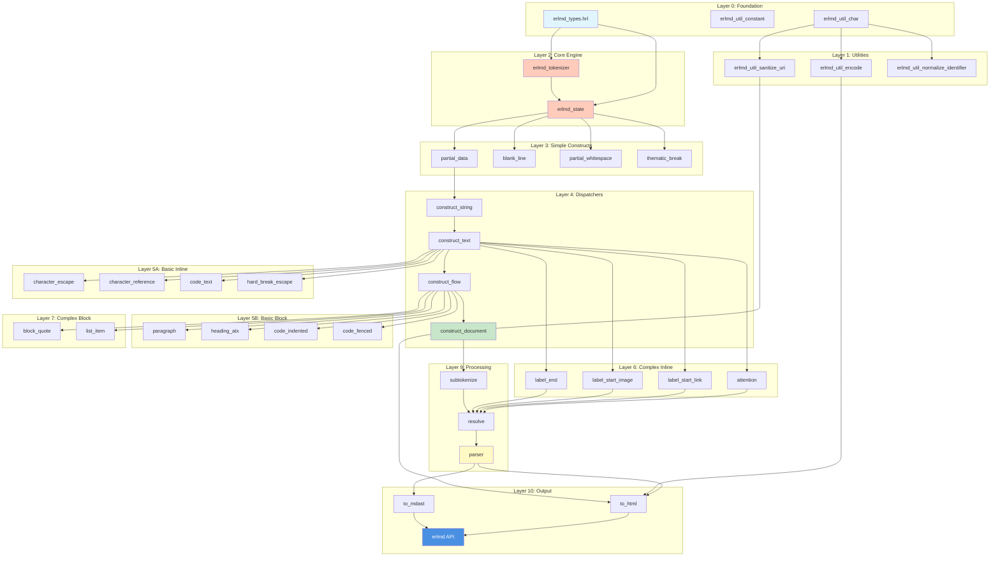

# erlmd Module Dependency Graph & Implementation Order

**Purpose**: Visual guide showing which modules depend on which, to inform implementation sequence

---

## Layer 0: No Dependencies (Week 1)

These modules have no dependencies and can be implemented first:

```
erlmd_types.hrl          [Header file - records and types]
erlmd_util_constant.erl  [Constants only]
erlmd_util_char.erl      [Character classification]
```

**Implementation Order**: Types → Constants → Character utils

---

## Layer 1: Foundation Utilities (Week 2)

Depend only on Layer 0:

```
erlmd_util_char.erl (Layer 0)
    ↓
erlmd_util_normalize_identifier.erl  [Uses char classification]
erlmd_util_encode.erl                [HTML entity encoding]
erlmd_util_sanitize_uri.erl          [URI validation, uses char]
```

**Implementation Order**: normalize → encode → sanitize_uri

---

## Layer 2: Core Engine (Week 2-3)

Build the state machine:

```
erlmd_types.hrl (Layer 0)
    ↓
erlmd_tokenizer.erl      [State machine driver]
    ↓
erlmd_state.erl          [State dispatcher - routes to constructs]
```

**Critical**: These must work before ANY construct can be implemented.

---

## Layer 3: Simplest Constructs (Week 3-4)

First working constructs that validate the architecture:

```
erlmd_tokenizer.erl (Layer 2)
erlmd_state.erl (Layer 2)
    ↓
erlmd_construct_partial_data.erl         [Plain text]
erlmd_construct_blank_line.erl           [Empty lines]
erlmd_construct_partial_whitespace.erl   [Whitespace]
erlmd_construct_partial_space_or_tab.erl [Specific whitespace]
erlmd_construct_thematic_break.erl       [Horizontal rules]
```

**Implementation Order**:

1. partial_data (simplest)
2. blank_line
3. partial_whitespace
4. thematic_break

**Test After Each**: Parse simple inputs like "Hello", "", "---"

---

## Layer 4: Content Dispatchers (Week 4-5)

The routing layer that determines which constructs apply:

```
erlmd_state.erl (Layer 2)
All Layer 3 Constructs
    ↓
erlmd_construct_string.erl   [Literal string content]
    ↓
erlmd_construct_text.erl     [Inline content dispatcher]
    ↓
erlmd_construct_flow.erl     [Block content dispatcher]
    ↓
erlmd_construct_document.erl [Top-level dispatcher]
```

**Implementation Order**: string → text → flow → document

**Dependency Notes**:

- `string` only allows data + escapes
- `text` allows data + all inline constructs
- `flow` allows all block constructs
- `document` is top-level entry point

---

## Layer 5A: Basic Inline Constructs (Week 6)

Can be implemented in parallel once `text` dispatcher exists:

```
erlmd_construct_text.erl (Layer 4)
    ↓
erlmd_construct_character_escape.erl    [Backslash escapes]
erlmd_construct_character_reference.erl [HTML entities]
erlmd_construct_code_text.erl           [Inline code]
erlmd_construct_hard_break_escape.erl   [Line breaks]
```

**Implementation Order** (parallel tracks):

- Track A: character_escape → character_reference
- Track B: code_text → hard_break_escape

**Dependencies**:

- `character_reference` needs entity lookup table (use `encode` util)

---

## Layer 5B: Basic Block Constructs (Week 5-6)

Can be implemented in parallel once `flow` dispatcher exists:

```
erlmd_construct_flow.erl (Layer 4)
    ↓
erlmd_construct_paragraph.erl      [Default block - MUST BE LAST in flow priority]
erlmd_construct_heading_atx.erl    [# Headings]
erlmd_construct_code_indented.erl  [Indented code blocks]
erlmd_construct_code_fenced.erl    [Fenced code blocks ```]
```

**Implementation Order**:

1. paragraph (simplest, but lowest priority)
2. heading_atx
3. code_indented
4. code_fenced

**Priority in Flow Dispatcher**:

```erlang
-define(FLOW_CONSTRUCTS, [
    blank_line,        % Highest priority
    thematic_break,
    code_fenced,
    code_indented,
    heading_atx,
    paragraph          % LOWEST priority (tried last)
]).
```

---

## Layer 6: Complex Inline - Delimiters (Week 7-8)

These require resolution (two-pass parsing):

```
erlmd_construct_text.erl (Layer 4)
    ↓
erlmd_construct_attention.erl          [* and _ delimiters for emphasis]
erlmd_construct_label_start_link.erl   [[ for links]
erlmd_construct_label_start_image.erl  ![[ for images]
erlmd_construct_label_end.erl          []] and destinations]
    ↓
erlmd_resolve.erl                      [Match delimiters]
```

**Implementation Order**:

1. attention (mark delimiters)
2. label_start_link
3. label_start_image
4. label_end
5. resolve (match opening/closing)

**Key Insight**: First pass marks potential delimiters, second pass (resolve) matches them.

---

## Layer 7: Complex Block - Nesting (Week 9-10)

Block constructs that can contain other blocks:

```
erlmd_construct_flow.erl (Layer 4)
    ↓
erlmd_construct_block_quote.erl  [> quotes - contains flow]
erlmd_construct_list_item.erl    [List items - contains flow]
    ↓
    (recursive - flow can contain block_quote/list_item)
```

**Implementation Order**:

1. block_quote (simpler)
2. list_item (complex: indentation, continuation, loose/tight)

**Challenge**: These are recursive - block quotes can contain paragraphs which are flow, and flow can contain block quotes.

---

## Layer 8: Advanced Block (Week 10-11)

Specialized block constructs:

```
erlmd_construct_flow.erl (Layer 4)
erlmd_util_* (various)
    ↓
erlmd_construct_heading_setext.erl  [Underlined headings]
erlmd_construct_html_flow.erl       [Raw HTML blocks]
erlmd_construct_definition.erl      [Link reference definitions]
```

**Implementation Order**:

1. heading_setext (medium complexity)
2. definition (needs link tracking)
3. html_flow (complex state machine)

---

## Layer 9: Processing Pipeline (Week 11-12)

Post-processing of events:

```
All Constructs
    ↓
erlmd_subtokenize.erl  [Parse nested content]
    ↓
erlmd_resolve.erl      [Match delimiters]
    ↓
erlmd_parser.erl       [Orchestration]
```

**Implementation Order**: subtokenize → resolve → parser

**Parser Dependencies**:

```
erlmd_parser.erl needs:
    - erlmd_tokenizer (to create initial tokenizer)
    - erlmd_state (to call document)
    - erlmd_subtokenize (to process nested content)
    - erlmd_resolve (to match delimiters)
```

---

## Layer 10: Output Generation (Week 12-13)

Convert events to output formats:

```
erlmd_parser.erl (Layer 9)
erlmd_util_encode.erl (Layer 1)
erlmd_util_sanitize_uri.erl (Layer 1)
    ↓
erlmd_to_html.erl   [Events → HTML]
erlmd_to_mdast.erl  [Events → AST]
    ↓
erlmd.erl           [Public API]
```

**Implementation Order**: to_html → to_mdast → public API

---

## Layer 11: GFM Extensions (Week 14-16)

GitHub Flavored Markdown extensions:

```
All Core Constructs
    ↓
erlmd_construct_gfm_table.erl                [Tables]
erlmd_construct_gfm_autolink_literal.erl     [URL detection]
erlmd_construct_gfm_strikethrough.erl        [~~text~~]
erlmd_construct_gfm_task_list_item_check.erl [[ ] checkboxes]
erlmd_construct_gfm_footnote_definition.erl  [Footnote defs]
erlmd_construct_gfm_label_start_footnote.erl [Footnote refs]
```

**Implementation Order**:

1. gfm_autolink_literal (simplest)
2. gfm_strikethrough (like emphasis)
3. gfm_task_list_item_check (extends list_item)
4. gfm_footnote_definition + gfm_label_start_footnote (together)
5. gfm_table (most complex - leave for last)

**Integration**: These extend existing content dispatchers:

- autolink → text dispatcher
- strikethrough → text dispatcher (after attention)
- task_list_item_check → list_item
- table → flow dispatcher
- footnote → document + text dispatchers

---

## Critical Path Analysis

### Must-Have-First

These BLOCK all other work:

1. **erlmd_types.hrl** - Everything needs the types
2. **erlmd_tokenizer.erl** - Core state machine
3. **erlmd_state.erl** - Dispatcher to constructs

### Can-Parallelize

Once Layer 4 (dispatchers) is done:

**Track A: Inline Constructs**

- character_escape
- character_reference
- code_text
- hard_break_escape
- (later) attention, labels

**Track B: Block Constructs**

- paragraph
- heading_atx
- code blocks
- (later) block_quote, lists

These tracks are independent and can be worked on by different developers or in separate sessions.

---

## Implementation Dependencies Checklist

Before implementing a module, ensure these are done:

### Before Any Construct

- [x] erlmd_types.hrl
- [x] erlmd_tokenizer.erl
- [x] erlmd_state.erl

### Before Inline Constructs

- [x] erlmd_construct_string.erl (if needed for nested content)
- [x] erlmd_construct_text.erl (dispatcher)
- [x] erlmd_construct_partial_data.erl (fallback)

### Before Block Constructs

- [x] erlmd_construct_flow.erl (dispatcher)
- [x] erlmd_construct_blank_line.erl (priority construct)
- [x] erlmd_construct_text.erl (for inline content in blocks)

### Before Resolution

- [x] All constructs that create delimiters (attention, labels)
- [x] Event stream validation

### Before Output

- [x] erlmd_parser.erl (orchestration)
- [x] All constructs implemented
- [x] Resolution working
- [x] erlmd_util_encode.erl (HTML entities)
- [x] erlmd_util_sanitize_uri.erl (XSS prevention)

### Before GFM

- [x] All core constructs working
- [x] 100% CommonMark spec passing
- [x] Output generation complete

---

## Testing Dependencies

### Integration Tests Need

| Test Type | Required Modules |
|-----------|-----------------|
| Simple parse | tokenizer + state + data |
| Block parse | + flow + paragraph |
| Inline parse | + text + escapes + entities |
| Full parse | + parser + subtokenize + resolve |
| HTML output | + to_html + encode + sanitize_uri |
| AST output | + to_mdast |
| GFM tests | + all GFM constructs |

---

## Visualization: Module Dependency Graph



---

## Summary: Implementation Order

**Strict Order (Sequential)**:

1. Types & constants
2. Character utilities
3. Tokenizer
4. State dispatcher
5. Data construct (test!)
6. Blank line (test!)
7. String dispatcher
8. Text dispatcher
9. Flow dispatcher
10. Document dispatcher

**Parallel Phase 1 (can do simultaneously)**:

- Basic inline constructs (escape, entity, code)
- Basic block constructs (paragraph, heading, code blocks)

**Parallel Phase 2 (can do simultaneously)**:

- Complex inline (attention, links, images)
- Complex block (block quotes, lists)

**Sequential Finale**:

1. Subtokenization
2. Resolution
3. Parser orchestration
4. HTML output
5. AST output
6. Public API

**Extensions** (after core complete):

- GFM constructs (can be parallel)

---

## Quick Reference: "Can I Implement X?"

**Q: Can I implement `paragraph` before `text`?**
A: No. Paragraph needs to call text dispatcher.

**Q: Can I implement `attention` before `resolve`?**
A: Yes. Attention marks delimiters, resolve matches them later.

**Q: Can I implement `block_quote` and `list_item` in parallel?**
A: Yes, they're independent (both extend flow).

**Q: Can I implement `to_html` before `parser`?**
A: No. to_html needs events from parser.

**Q: Can I implement GFM before finishing core?**
A: Technically yes, but don't. Finish core first (649 CommonMark tests pass).

**Q: What's the absolute minimum for a "Hello World" test?**
A: types + tokenizer + state + data + document

---

This dependency graph should make it crystal clear what can be built when!
