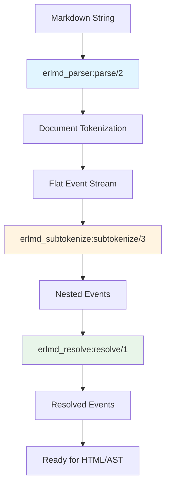

# Phase 9: Processing Pipeline - Implementation Guide

**Phase**: 9 (Processing Pipeline)  
**Duration**: 2 weeks  
**Complexity**: High  
**Date**: November 15, 2025

---

## Table of Contents

1. [Overview](#overview)
2. [Context & Prerequisites](#context--prerequisites)
3. [Module Specifications](#module-specifications)
4. [Implementation Order](#implementation-order)
5. [Detailed Implementation Instructions](#detailed-implementation-instructions)
6. [Test Requirements](#test-requirements)
7. [Common Pitfalls](#common-pitfalls)
8. [Acceptance Criteria](#acceptance-criteria)

---

## Overview

### What This Phase Delivers

Phase 9 implements the **processing pipeline** that transforms raw events into fully resolved, nested markdown structures. This is the "glue" that connects all previous phases together.

**Key Components**:

1. **Subtokenization** (`erlmd_subtokenize.erl`) - Recursively processes nested content
2. **Resolvers** (`erlmd_resolve.erl`) - Post-processes events to match delimiters
3. **Parser Orchestration** (`erlmd_parser.erl`) - Main entry point tying everything together

**Why This Matters**:

Without this phase, you have flat event streams with unmatched delimiters. This phase:
- Parses inline content within block constructs
- Matches emphasis markers (`*`, `_`, `~`)
- Resolves link/image references
- Merges data sequences
- Creates the final event stream ready for output

---

## Context & Prerequisites

### Required Modules (Already Implemented)

✅ **Phase 1-2**: Foundation
- `erlmd_tokenizer.erl` - State machine driver
- `erlmd_state.erl` - State dispatcher
- `erlmd_event.erl` - Event types
- `types.hrl` - Core records

✅ **Phase 3-5**: Block Constructs
- `erlmd_cnstr_document.erl`
- `erlmd_cnstr_flow.erl`
- `erlmd_cnstr_paragraph.erl`
- `erlmd_cnstr_heading_atx.erl`
- Block constructs with `link` fields set

✅ **Phase 6-7**: Inline Constructs
- `erlmd_cnstr_text.erl`
- `erlmd_cnstr_attention.erl`
- `erlmd_cnstr_label_end.erl`
- Partial constructs (`data`, `space_or_tab`, etc.)

### Architecture Understanding



### Key Concepts

**1. Event Links**:
Events can be "linked" to indicate nested content that needs re-parsing:

```erlang
#event{
    kind = enter,
    name = paragraph,
    link = #link{
        previous = undefined,
        next = 5,  % Index of next linked event
        content = text  % Content type to parse
    }
}
```

**2. Content Types**:
- `document` - Top-level
- `flow` - Block-level
- `text` - Inline content
- `string` - Plain text (no parsing)
- `content` - Special for definitions

**3. Resolvers**:
Post-process events to match delimiters:
- `attention` - Match `*`, `_`, `~` sequences
- `label` - Match links/images `[]()`
- `data` - Merge adjacent data events
- `text`, `string` - Merge whitespace

---

## Module Specifications

### Module 1: `erlmd_subtokenize.erl`

**Purpose**: Recursively tokenize nested content within linked events.

**Key Functions**:

```erlang
-module(erlmd_subtokenize).
-export([
    subtokenize/3,
    link/2,
    link_to/3,
    divide_events/5
]).

-include("types.hrl").

-record(subresult, {
    done :: boolean(),
    definitions = [] :: [binary()],
    gfm_footnote_definitions = [] :: [binary()]
}).

%% Main entry point
-spec subtokenize(Events, ParseState, Filter) -> {ok, subresult()} | {error, term()}
    when Events :: [event()],
         ParseState :: map(),
         Filter :: content_type() | undefined.

%% Link two events together
-spec link(Events :: [event()], Index :: non_neg_integer()) -> [event()].

%% Link arbitrary events
-spec link_to(Events, Previous, Next) -> [event()]
    when Events :: [event()],
         Previous :: non_neg_integer(),
         Next :: non_neg_integer().
```

**Algorithm**:

1. Find events with `link` field set
2. For each link chain, create a new tokenizer
3. Feed linked slices to the subtokenizer
4. Collect resulting sub-events
5. Divide sub-events back into original event positions
6. Replace links with actual parsed events

---

### Module 2: `erlmd_resolve.erl`

**Purpose**: Dispatch to specific resolver implementations.

**Key Functions**:

```erlang
-module(erlmd_resolve).
-export([resolve/1, call/2]).

-include("types.hrl").

-type resolve_name() :: attention | label | data | text | string | 
                        heading_atx | heading_setext | list_item | 
                        content | gfm_table.

%% Main entry - resolve all registered resolvers
-spec resolve(Events :: [event()]) -> [event()].

%% Call specific resolver
-spec call(Tokenizer :: tokenizer(), Name :: resolve_name()) -> 
    {ok, subresult() | undefined} | {error, term()}.
```

**Implementation**:

```erlang
resolve(Events) ->
    % Get resolvers registered during parsing
    % Call each one in order
    % Return fully resolved events
    Events.

call(Tokenizer, Name) ->
    case Name of
        attention -> erlmd_cnstr_attention:resolve(Tokenizer);
        label -> erlmd_cnstr_label_end:resolve(Tokenizer);
        data -> erlmd_cnstr_prtl_data:resolve(Tokenizer);
        text -> erlmd_cnstr_text:resolve(Tokenizer);
        string -> erlmd_cnstr_string:resolve(Tokenizer);
        heading_atx -> erlmd_cnstr_heading_atx:resolve(Tokenizer);
        heading_setext -> erlmd_cnstr_heading_setext:resolve(Tokenizer);
        list_item -> erlmd_cnstr_list_item:resolve(Tokenizer);
        content -> erlmd_cnstr_content:resolve(Tokenizer);
        gfm_table -> erlmd_ext_gfm_table:resolve(Tokenizer)
    end.
```

---

### Module 3: `erlmd_parser.erl`

**Purpose**: Main orchestration - entry point for parsing.

**Key Functions**:

```erlang
-module(erlmd_parser).
-export([parse/2]).

-include("types.hrl").

-record(parse_state, {
    options :: map(),
    bytes :: binary(),
    definitions = [] :: [binary()],
    gfm_footnote_definitions = [] :: [binary()],
    location = undefined :: map() | undefined
}).

%% Main entry point
-spec parse(Input :: binary(), Options :: map()) -> 
    {ok, [event()], parse_state()} | {error, term()}.
```

**Algorithm** (from Rust `parser.rs`):

```erlang
parse(Input, Options) ->
    % 1. Create parse state
    ParseState = #parse_state{
        options = Options,
        bytes = Input,
        definitions = [],
        gfm_footnote_definitions = []
    },
    
    % 2. Create initial tokenizer
    StartPoint = #point{line = 1, column = 1, offset = 0},
    Tokenizer = erlmd_tokenizer:new(StartPoint, ParseState),
    
    % 3. Push document state
    State = erlmd_tokenizer:push(
        Tokenizer,
        {0, 0},
        {byte_size(Input), 0},
        {next, document_start}
    ),
    
    % 4. Flush initial parse
    case erlmd_tokenizer:flush(State, true) of
        {ok, Result1, T1} ->
            Events1 = erlmd_tokenizer:events(T1),
            
            % 5. Loop: subtokenize until done
            subtokenize_loop(Events1, ParseState, Result1);
        {error, Reason} ->
            {error, Reason}
    end.

subtokenize_loop(Events, ParseState, Result) ->
    % Update definitions
    ParseState2 = ParseState#parse_state{
        definitions = ParseState#parse_state.definitions ++ 
                     Result#subresult.definitions,
        gfm_footnote_definitions = 
            ParseState#parse_state.gfm_footnote_definitions ++ 
            Result#subresult.gfm_footnote_definitions
    },
    
    % Check if done
    if Result#subresult.done ->
        {ok, Events, ParseState2};
    true ->
        % Subtokenize again
        case erlmd_subtokenize:subtokenize(Events, ParseState2, undefined) of
            {ok, Result2} ->
                subtokenize_loop(Events, ParseState2, Result2);
            {error, Reason} ->
                {error, Reason}
        end
    end.
```

---

## Implementation Order

### Week 1: Subtokenization

**Day 1-2**: `erlmd_subtokenize.erl` - Basic Framework
- [ ] Implement `link/2` and `link_to/3` helper functions
- [ ] Create `subresult` record type
- [ ] Implement basic `subtokenize/3` skeleton
- [ ] Write unit tests for link functions

**Day 3-4**: `erlmd_subtokenize.erl` - Core Algorithm
- [ ] Implement event iteration and link detection
- [ ] Create subtokenizers for linked content
- [ ] Implement `divide_events/5` for distributing sub-events
- [ ] Test with simple nested content (paragraph with inline)

**Day 5**: Integration Testing
- [ ] Test paragraph with emphasis
- [ ] Test heading with links
- [ ] Debug event stream issues

### Week 2: Resolvers & Parser

**Day 1-2**: Resolver Infrastructure
- [ ] Implement `erlmd_resolve.erl` dispatcher
- [ ] Add resolver registration to tokenizer
- [ ] Implement attention resolver (most complex)
- [ ] Test emphasis/strong matching

**Day 3**: More Resolvers
- [ ] Implement label (link/image) resolver
- [ ] Implement data merger
- [ ] Test link resolution

**Day 4**: Parser Orchestration
- [ ] Implement `erlmd_parser.erl`
- [ ] Wire up parse loop
- [ ] Test end-to-end parsing

**Day 5**: Integration & Testing
- [ ] Run full CommonMark test suite
- [ ] Fix bugs
- [ ] Performance testing

---

## Detailed Implementation Instructions

### Part 1: erlmd_subtokenize.erl

#### Step 1.1: Module Setup

```erlang
-module(erlmd_subtokenize).
-export([
    subtokenize/3,
    link/2,
    link_to/3
]).

-include("types.hrl").

-record(subresult, {
    done = true :: boolean(),
    definitions = [] :: [binary()],
    gfm_footnote_definitions = [] :: [binary()]
}).
```

#### Step 1.2: Link Helper Functions

**Reference**: `src/subtokenize.rs` lines 36-62

```erlang
%% Link current event to previous void event
%% This is an optimization for the common case
-spec link(Events :: [event()], Index :: non_neg_integer()) -> [event()].
link(Events, Index) ->
    link_to(Events, Index - 2, Index).

%% Link two arbitrary events
-spec link_to(Events, Previous, Next) -> [event()]
    when Events :: [event()],
         Previous :: non_neg_integer(),
         Next :: non_neg_integer().
link_to(Events, Previous, Next) ->
    % Validate
    PrevEvent = lists:nth(Previous + 1, Events),
    NextEvent = lists:nth(Next + 1, Events),
    
    % Previous must be an Enter event
    true = PrevEvent#event.kind =:= enter,
    
    % Previous must be a void event (has matching Exit immediately after)
    PrevExit = lists:nth(Previous + 2, Events),
    true = PrevExit#event.kind =:= exit,
    true = PrevExit#event.name =:= PrevEvent#event.name,
    
    % Next must be Enter
    true = NextEvent#event.kind =:= enter,
    
    % Update links
    PrevLink = PrevEvent#event.link,
    NextLink = NextEvent#event.link,
    
    % Set next pointer on previous
    PrevLink2 = PrevLink#link{next = Next},
    PrevEvent2 = PrevEvent#event{link = PrevLink2},
    
    % Set previous pointer on next
    NextLink2 = NextLink#link{previous = Previous},
    NextEvent2 = NextEvent#event{link = NextLink2},
    
    % Content types must match
    true = PrevLink2#link.content =:= NextLink2#link.content,
    
    % Update events list
    Events2 = lists:sublist(Events, Previous) ++ 
              [PrevEvent2] ++
              lists:sublist(Events, Previous + 2, Next - Previous - 1) ++
              [NextEvent2] ++
              lists:nthtail(Next + 1, Events),
    
    Events2.
```

#### Step 1.3: Main Subtokenize Function

**Reference**: `src/subtokenize.rs` lines 64-150

```erlang
-spec subtokenize(Events, ParseState, Filter) -> {ok, subresult()} | {error, term()}
    when Events :: [event()],
         ParseState :: parse_state(),
         Filter :: content_type() | undefined.
subtokenize(Events, ParseState, Filter) ->
    Map = erlmd_edit_map:new(),
    Result = #subresult{
        done = true,
        definitions = [],
        gfm_footnote_definitions = []
    },
    
    % Process events to find and handle links
    process_events(Events, ParseState, Filter, Map, Result, 0, {0, 0}).

process_events(Events, _ParseState, _Filter, Map, Result, Index, Acc) 
        when Index >= length(Events) ->
    % Done - apply map and return
    Events2 = erlmd_edit_map:consume(Map, Events),
    {ok, Result, Events2};
    
process_events(Events, ParseState, Filter, Map, Result, Index, Acc) ->
    Event = lists:nth(Index + 1, Events),
    
    case Event#event.link of
        undefined ->
            % No link, continue
            process_events(Events, ParseState, Filter, Map, Result, 
                          Index + 1, Acc);
            
        Link when Event#event.kind =:= enter ->
            % Check if this is the start of a link chain
            case Link#link.previous of
                undefined when Filter =:= undefined; 
                              Filter =:= Link#link.content ->
                    % This is a link start - process the chain
                    case process_link_chain(Events, ParseState, Index, Link) of
                        {ok, SubEvents, SubResult} ->
                            % Divide sub-events back into events
                            Acc2 = divide_events(Map, Events, Index, 
                                                SubEvents, Acc),
                            
                            % Merge results
                            Result2 = #subresult{
                                done = false,
                                definitions = Result#subresult.definitions ++
                                            SubResult#subresult.definitions,
                                gfm_footnote_definitions = 
                                    Result#subresult.gfm_footnote_definitions ++
                                    SubResult#subresult.gfm_footnote_definitions
                            },
                            
                            process_events(Events, ParseState, Filter, Map, 
                                         Result2, Index + 1, Acc2);
                        {error, Reason} ->
                            {error, Reason}
                    end;
                    
                _ ->
                    % Already processed or filtered out
                    process_events(Events, ParseState, Filter, Map, Result,
                                  Index + 1, Acc)
            end;
            
        _ ->
            % Not an enter event with link
            process_events(Events, ParseState, Filter, Map, Result,
                          Index + 1, Acc)
    end.
```

#### Step 1.4: Process Link Chain

**Reference**: `src/subtokenize.rs` lines 90-135

```erlang
%% Process a chain of linked events
process_link_chain(Events, ParseState, StartIndex, Link) ->
    % Create subtokenizer
    StartEvent = lists:nth(StartIndex + 1, Events),
    Tokenizer = erlmd_tokenizer:new(StartEvent#event.point, ParseState),
    
    % Determine initial state based on content type
    State = case Link#link.content of
        content -> {next, content_definition_before};
        string -> {next, string_start};
        text -> {next, text_start};
        _ -> {error, {unsupported_content_type, Link#link.content}}
    end,
    
    % Check for GFM task list item special case
    Tokenizer2 = check_task_list_context(Events, StartIndex, Tokenizer),
    
    % Loop through link chain
    case feed_link_chain(Events, StartIndex, Link, Tokenizer2, State) of
        {ok, Tokenizer3, FinalState} ->
            % Flush the tokenizer
            case erlmd_tokenizer:flush(Tokenizer3, FinalState, true) of
                {ok, SubResult} ->
                    SubEvents = erlmd_tokenizer:events(Tokenizer3),
                    {ok, SubEvents, SubResult};
                {error, Reason} ->
                    {error, Reason}
            end;
        {error, Reason} ->
            {error, Reason}
    end.

%% Feed all events in the link chain to the subtokenizer
feed_link_chain(Events, LinkIndex, Link, Tokenizer, State) ->
    Event = lists:nth(LinkIndex + 1, Events),
    ExitEvent = lists:nth(LinkIndex + 2, Events),
    
    % If not the first link, define skip point
    Tokenizer2 = case Link#link.previous of
        undefined -> Tokenizer;
        _ -> erlmd_tokenizer:define_skip(Tokenizer, Event#event.point)
    end,
    
    % Push this slice
    State2 = erlmd_tokenizer:push(
        Tokenizer2,
        {Event#event.point#point.offset, Event#event.point#point.vs},
        {ExitEvent#event.point#point.offset, ExitEvent#event.point#point.vs},
        State
    ),
    
    % Continue to next link if exists
    case Link#link.next of
        undefined ->
            {ok, Tokenizer2, State2};
        NextIndex ->
            NextEvent = lists:nth(NextIndex + 1, Events),
            NextLink = NextEvent#event.link,
            feed_link_chain(Events, NextIndex, NextLink, Tokenizer2, State2)
    end.
```

#### Step 1.5: Divide Events

**Reference**: `src/subtokenize.rs` lines 152-240

This is complex - it distributes sub-events back to their corresponding link positions.

```erlang
%% Divide child events over links in events
-spec divide_events(Map, Events, LinkIndex, ChildEvents, AccBefore) -> Acc
    when Map :: edit_map(),
         Events :: [event()],
         LinkIndex :: non_neg_integer(),
         ChildEvents :: [event()],
         AccBefore :: {non_neg_integer(), non_neg_integer()},
         Acc :: {non_neg_integer(), non_neg_integer()}.
divide_events(Map, Events, LinkIndex, ChildEvents, AccBefore) ->
    % Build slices - which child events belong to which link
    Slices = build_slices(Events, LinkIndex, ChildEvents, []),
    
    % Fix deep links in child events
    fix_deep_links(ChildEvents, LinkIndex, Slices, AccBefore),
    
    % Inject sub-events back into events
    inject_slices(Map, Events, ChildEvents, Slices),
    
    % Return new accumulator
    {element(1, AccBefore) + (length(Slices) * 2), 
     element(2, AccBefore) + length(ChildEvents)}.

build_slices(Events, LinkIndex, ChildEvents, Slices) ->
    build_slices(Events, LinkIndex, ChildEvents, Slices, 0, 0).

build_slices(_Events, _LinkIndex, ChildEvents, Slices, ChildIndex, SliceStart) 
        when ChildIndex >= length(ChildEvents) ->
    lists:reverse(Slices);
    
build_slices(Events, LinkIndex, ChildEvents, Slices, ChildIndex, SliceStart) ->
    ChildEvent = lists:nth(ChildIndex + 1, ChildEvents),
    EndEvent = lists:nth(LinkIndex + 2, Events),
    
    % Check if this child event is past the current link's end
    CurrentPoint = ChildEvent#event.point,
    EndPoint = EndEvent#event.point,
    
    if CurrentPoint#point.offset > EndPoint#point.offset; 
       (CurrentPoint#point.offset =:= EndPoint#point.offset andalso 
        CurrentPoint#point.vs > EndPoint#point.vs) ->
        % Move to next link
        NewSlices = [{LinkIndex, SliceStart} | Slices],
        LinkEvent = lists:nth(LinkIndex + 1, Events),
        NextIndex = LinkEvent#event.link#link.next,
        build_slices(Events, NextIndex, ChildEvents, NewSlices, 
                    ChildIndex, ChildIndex);
    true ->
        % Continue with this link
        build_slices(Events, LinkIndex, ChildEvents, Slices,
                    ChildIndex + 1, SliceStart)
    end.
```

**Note**: The divide_events implementation is complex. For initial implementation:
1. Start with a simplified version that handles non-nested cases
2. Add complexity incrementally
3. Test extensively with nested structures

---

### Part 2: Attention Resolver

The attention resolver matches `*`, `_`, and `~` sequences to create emphasis, strong, and strikethrough.

**Reference**: `src/construct/attention.rs` lines 121-342

#### Step 2.1: Update erlmd_cnstr_attention.erl

Add resolver function:

```erlang
%% Resolve attention sequences
-spec resolve(Tokenizer :: tokenizer()) -> undefined.
resolve(Tokenizer) ->
    % 1. Find all attention sequences and gather info
    Sequences = get_sequences(Tokenizer),
    
    % 2. Match sequences together
    match_sequences(Tokenizer, Sequences, 0),
    
    % 3. Mark remaining sequences as data
    mark_remaining_as_data(Tokenizer, Sequences),
    
    % 4. Apply edits
    erlmd_edit_map:consume(Tokenizer#tokenizer.map, 
                          Tokenizer#tokenizer.events),
    undefined.
```

#### Step 2.2: Get Sequences

**Reference**: `attention.rs` lines 217-269

```erlang
-record(sequence, {
    marker :: byte(),          % $*, $_, or $~
    stack = [] :: [non_neg_integer()],  % Balance tracking
    index :: non_neg_integer(), % Event index
    start_point :: point(),
    end_point :: point(),
    size :: non_neg_integer(),  % Number of markers
    open :: boolean(),          % Can open attention
    close :: boolean()          % Can close attention
}).

get_sequences(Tokenizer) ->
    Events = Tokenizer#tokenizer.events,
    get_sequences(Events, Tokenizer, 0, [], []).

get_sequences(Events, _Tokenizer, Index, _Stack, Sequences) 
        when Index >= length(Events) ->
    lists:reverse(Sequences);
    
get_sequences(Events, Tokenizer, Index, Stack, Sequences) ->
    Event = lists:nth(Index + 1, Events),
    
    case Event of
        #event{kind = enter, name = attention_sequence} ->
            % Get sequence info
            ExitEvent = lists:nth(Index + 2, Events),
            Sequence = analyze_sequence(Event, ExitEvent, Stack, Index, 
                                       Tokenizer),
            get_sequences(Events, Tokenizer, Index + 1, Stack,
                         [Sequence | Sequences]);
                         
        #event{kind = enter} ->
            % Push to stack
            get_sequences(Events, Tokenizer, Index + 1, 
                         [Index | Stack], Sequences);
                         
        #event{kind = exit} ->
            % Pop from stack
            get_sequences(Events, Tokenizer, Index + 1,
                         tl(Stack), Sequences);
                         
        _ ->
            get_sequences(Events, Tokenizer, Index + 1, Stack, Sequences)
    end.

analyze_sequence(EnterEvent, ExitEvent, Stack, Index, Tokenizer) ->
    Bytes = Tokenizer#tokenizer.parse_state#parse_state.bytes,
    Marker = binary:at(Bytes, EnterEvent#event.point#point.offset),
    
    % Classify characters before and after
    BeforeChar = char_before_index(Bytes, EnterEvent#event.point#point.offset),
    AfterChar = char_after_index(Bytes, ExitEvent#event.point#point.offset),
    
    Before = erlmd_util_char:classify_opt(BeforeChar),
    After = erlmd_util_char:classify_opt(AfterChar),
    
    % Determine if can open/close
    CanOpen = can_open(After, Before, Marker, AfterChar, Tokenizer),
    CanClose = can_close(Before, After, Marker, BeforeChar, Tokenizer),
    
    % Special rules for underscores
    {Open, Close} = case Marker of
        $_ ->
            {CanOpen andalso (Before =/= other orelse not CanClose),
             CanClose andalso (After =/= other orelse not CanOpen)};
        _ ->
            {CanOpen, CanClose}
    end,
    
    #sequence{
        marker = Marker,
        stack = Stack,
        index = Index,
        start_point = EnterEvent#event.point,
        end_point = ExitEvent#event.point,
        size = ExitEvent#event.point#point.offset - 
               EnterEvent#event.point#point.offset,
        open = Open,
        close = Close
    }.
```

#### Step 2.3: Match Sequences

**Reference**: `attention.rs` lines 154-215, 271-342

```erlang
match_sequences(Tokenizer, Sequences, CloseIdx) 
        when CloseIdx >= length(Sequences) ->
    ok;
    
match_sequences(Tokenizer, Sequences, CloseIdx) ->
    CloseSeq = lists:nth(CloseIdx + 1, Sequences),
    
    case CloseSeq#sequence.close of
        true ->
            % Find matching opener
            case find_opener(Sequences, CloseIdx) of
                {ok, OpenIdx} ->
                    % Match them
                    Sequences2 = do_match(Tokenizer, Sequences, OpenIdx, CloseIdx),
                    NextIdx = CloseIdx; % May have shifted
                    match_sequences(Tokenizer, Sequences2, NextIdx);
                not_found ->
                    match_sequences(Tokenizer, Sequences, CloseIdx + 1)
            end;
        false ->
            match_sequences(Tokenizer, Sequences, CloseIdx + 1)
    end.

find_opener(Sequences, CloseIdx) ->
    CloseSeq = lists:nth(CloseIdx + 1, Sequences),
    find_opener(Sequences, CloseIdx, CloseIdx - 1, CloseSeq).

find_opener(_Sequences, _CloseIdx, OpenIdx, _CloseSeq) when OpenIdx < 0 ->
    not_found;
    
find_opener(Sequences, CloseIdx, OpenIdx, CloseSeq) ->
    OpenSeq = lists:nth(OpenIdx + 1, Sequences),
    
    % Check if matches
    if OpenSeq#sequence.open andalso
       OpenSeq#sequence.marker =:= CloseSeq#sequence.marker andalso
       OpenSeq#sequence.stack =:= CloseSeq#sequence.stack ->
        % Check modulo 3 rule
        case check_modulo_rule(OpenSeq, CloseSeq) of
            ok ->
                % Check GFM strikethrough rules
                case check_strikethrough_rules(OpenSeq, CloseSeq) of
                    ok -> {ok, OpenIdx};
                    fail -> find_opener(Sequences, CloseIdx, OpenIdx - 1, CloseSeq)
                end;
            fail ->
                find_opener(Sequences, CloseIdx, OpenIdx - 1, CloseSeq)
        end;
    true ->
        find_opener(Sequences, CloseIdx, OpenIdx - 1, CloseSeq)
    end.

check_modulo_rule(OpenSeq, CloseSeq) ->
    % If either can both open and close, and close size is not multiple of 3,
    % but sum is multiple of 3, then don't match
    if (OpenSeq#sequence.close orelse CloseSeq#sequence.open) andalso
       (CloseSeq#sequence.size rem 3 =/= 0) andalso
       ((OpenSeq#sequence.size + CloseSeq#sequence.size) rem 3 =:= 0) ->
        fail;
    true ->
        ok
    end.

check_strikethrough_rules(OpenSeq, CloseSeq) ->
    if CloseSeq#sequence.marker =:= $~ ->
        % Must be same size, max 2, and if size=1 must allow single tilde
        if OpenSeq#sequence.size =/= CloseSeq#sequence.size ->
            fail;
        CloseSeq#sequence.size > 2 ->
            fail;
        CloseSeq#sequence.size =:= 1 ->
            % Check option
            fail; % Simplified - check actual option
        true ->
            ok
        end;
    true ->
        ok
    end.
```

#### Step 2.4: Do Match

This creates the emphasis/strong/strikethrough events:

```erlang
do_match(Tokenizer, Sequences, OpenIdx, CloseIdx) ->
    OpenSeq = lists:nth(OpenIdx + 1, Sequences),
    CloseSeq = lists:nth(CloseIdx + 1, Sequences),
    
    % Determine how many markers to take (1 or 2)
    Take = if OpenSeq#sequence.size > 1 andalso 
              CloseSeq#sequence.size > 1 -> 2;
           true -> 1
    end,
    
    % Mark everything between as can't open (prevent misnesting)
    Sequences2 = mark_between_no_open(Sequences, OpenIdx + 1, CloseIdx),
    
    % Determine event names
    {GroupName, SeqName, TextName} = 
        case {CloseSeq#sequence.marker, Take} of
            {$~, _} -> {gfm_strikethrough, gfm_strikethrough_sequence,
                       gfm_strikethrough_text};
            {_, 1} -> {emphasis, emphasis_sequence, emphasis_text};
            {_, 2} -> {strong, strong_sequence, strong_text}
        end,
    
    % Update sequence sizes
    OpenSeq2 = OpenSeq#sequence{
        size = OpenSeq#sequence.size - Take,
        end_point = adjust_point(OpenSeq#sequence.end_point, -Take)
    },
    CloseSeq2 = CloseSeq#sequence{
        size = CloseSeq#sequence.size - Take,
        start_point = adjust_point(CloseSeq#sequence.start_point, Take)
    },
    
    % Create events for opening
    inject_opening_events(Tokenizer, OpenSeq, OpenSeq2, GroupName, 
                         SeqName, TextName),
    
    % Create events for closing  
    inject_closing_events(Tokenizer, CloseSeq, CloseSeq2, GroupName,
                         SeqName, TextName),
    
    % Update sequences list
    Sequences3 = update_sequences(Sequences2, OpenIdx, CloseIdx, 
                                 OpenSeq2, CloseSeq2),
    
    Sequences3.
```

---

### Part 3: Label (Link/Image) Resolver

**Reference**: `src/construct/label_end.rs` lines 614-707

This is simpler than attention - it just injects grouping events around matched labels.

```erlang
%% In erlmd_cnstr_label_end.erl

-spec resolve(Tokenizer :: tokenizer()) -> undefined.
resolve(Tokenizer) ->
    % Get matched labels from tokenizer state
    Labels = Tokenizer#tokenizer.tokenize_state#tokenize_state.labels,
    
    % Inject grouping events
    inject_labels(Tokenizer, Labels),
    
    % Handle loose label starts (mark as data)
    Starts = Tokenizer#tokenizer.tokenize_state#tokenize_state.label_starts,
    LooseStarts = Tokenizer#tokenizer.tokenize_state#tokenize_state.label_starts_loose,
    
    mark_as_data(Tokenizer, Starts),
    mark_as_data(Tokenizer, LooseStarts),
    
    % Apply edits
    erlmd_edit_map:consume(Tokenizer#tokenizer.map,
                          Tokenizer#tokenizer.events),
    undefined.

inject_labels(Tokenizer, Labels) ->
    lists:foreach(fun(Label) ->
        inject_label(Tokenizer, Label)
    end, Labels).

inject_label(Tokenizer, Label) ->
    % Determine group name
    GroupName = case Label#label.kind of
        gfm_footnote -> gfm_footnote_call;
        image -> image;
        link -> link;
        gfm_undefined_footnote -> link
    end,
    
    % Handle undefined footnote special case (inject caret)
    case Label#label.kind of
        gfm_undefined_footnote ->
            inject_caret(Tokenizer, Label);
        _ ->
            ok
    end,
    
    % Insert group enter and label enter at label start
    {StartEnter, StartExit} = Label#label.start,
    erlmd_edit_map:add(Tokenizer#tokenizer.map, StartEnter, 0, [
        #event{kind = enter, name = GroupName, 
               point = get_point(Tokenizer, StartEnter)},
        #event{kind = enter, name = label,
               point = get_point(Tokenizer, StartEnter)}
    ]),
    
    % Insert label text if needed
    if StartExit =/= element(1, Label#label.'end') ->
        inject_label_text(Tokenizer, Label);
    true ->
        ok
    end,
    
    % Insert label exit and group exit at label end
    {EndEnter, EndExit} = Label#label.'end',
    erlmd_edit_map:add(Tokenizer#tokenizer.map, EndEnter + 4, 0, [
        #event{kind = exit, name = label,
               point = get_point(Tokenizer, EndEnter + 3)}
    ]),
    erlmd_edit_map:add(Tokenizer#tokenizer.map, EndExit + 1, 0, [
        #event{kind = exit, name = GroupName,
               point = get_point(Tokenizer, EndExit)}
    ]),
    
    ok.
```

---

### Part 4: Parser Orchestration

**Reference**: `src/parser.rs`

```erlang
-module(erlmd_parser).
-export([parse/2]).

-include("types.hrl").

-spec parse(Input :: binary(), Options :: map()) ->
    {ok, [event()], parse_state()} | {error, term()}.
parse(Input, Options) ->
    % Create parse state
    ParseState = #parse_state{
        options = Options,
        bytes = Input,
        definitions = [],
        gfm_footnote_definitions = [],
        location = case need_location(Options) of
            true -> erlmd_util_location:new(Input);
            false -> undefined
        end
    },
    
    % Create tokenizer
    StartPoint = #point{line = 1, column = 1, offset = 0, vs = 0},
    Tokenizer = erlmd_tokenizer:new(StartPoint, ParseState),
    
    % Push document state
    State = erlmd_tokenizer:push(
        Tokenizer,
        {0, 0},
        {byte_size(Input), 0},
        {next, document_start}
    ),
    
    % Flush initial tokenization
    case erlmd_tokenizer:flush(Tokenizer, State, true) of
        {ok, Result} ->
            Events = erlmd_tokenizer:events(Tokenizer),
            parse_loop(Events, ParseState, Result);
        {error, Reason} ->
            {error, Reason}
    end.

%% Loop until subtokenization is complete
parse_loop(Events, ParseState, Result) ->
    % Update definitions
    ParseState2 = ParseState#parse_state{
        definitions = ParseState#parse_state.definitions ++
                     Result#subresult.definitions,
        gfm_footnote_definitions = 
            ParseState#parse_state.gfm_footnote_definitions ++
            Result#subresult.gfm_footnote_definitions
    },
    
    case Result#subresult.done of
        true ->
            {ok, Events, ParseState2};
        false ->
            case erlmd_subtokenize:subtokenize(Events, ParseState2, undefined) of
                {ok, Result2, Events2} ->
                    parse_loop(Events2, ParseState2, Result2);
                {error, Reason} ->
                    {error, Reason}
            end
    end.

need_location(Options) ->
    maps:is_key(mdx_esm_parse, Options) orelse
    maps:is_key(mdx_expression_parse, Options).
```

---

## Test Requirements

### Unit Tests

#### Test 1: Link Functions

```erlang
-module(erlmd_subtokenize_test).
-include_lib("eunit/include/eunit.hrl").
-include("types.hrl").

link_simple_test() ->
    Events = [
        #event{kind = enter, name = data, 
               link = #link{content = text}},
        #event{kind = exit, name = data},
        #event{kind = enter, name = emphasis_sequence,
               link = #link{content = text}},
        #event{kind = exit, name = emphasis_sequence}
    ],
    Events2 = erlmd_subtokenize:link(Events, 2),
    
    % Check links were set
    E0 = lists:nth(1, Events2),
    E2 = lists:nth(3, Events2),
    ?assertEqual(2, E0#event.link#link.next),
    ?assertEqual(0, E2#event.link#link.previous).
```

#### Test 2: Attention Resolution

```erlang
attention_simple_emphasis_test() ->
    % "*hello*"
    Input = <<"*hello*">>,
    {ok, Events, _} = erlmd_parser:parse(Input, #{}),
    
    % Should have emphasis events
    Names = [E#event.name || E <- Events],
    ?assert(lists:member(emphasis, Names)),
    ?assert(lists:member(emphasis_sequence, Names)),
    ?assert(lists:member(emphasis_text, Names)).

attention_strong_test() ->
    % "**hello**"
    Input = <<"**hello**">>,
    {ok, Events, _} = erlmd_parser:parse(Input, #{}),
    
    Names = [E#event.name || E <- Events],
    ?assert(lists:member(strong, Names)).

attention_nested_test() ->
    % "***hello***"
    Input = <<"***hello***">>,
    {ok, Events, _} = erlmd_parser:parse(Input, #{}),
    
    Names = [E#event.name || E <- Events],
    ?assert(lists:member(emphasis, Names)),
    ?assert(lists:member(strong, Names)).
```

#### Test 3: Link Resolution

```erlang
link_inline_test() ->
    % "[text](url)"
    Input = <<"[text](url)">>,
    {ok, Events, _} = erlmd_parser:parse(Input, #{}),
    
    Names = [E#event.name || E <- Events],
    ?assert(lists:member(link, Names)),
    ?assert(lists:member(label, Names)),
    ?assert(lists:member(resource, Names)).

link_reference_test() ->
    % "[text][ref]" with definition
    Input = <<"[ref]: url\n\n[text][ref]">>,
    {ok, Events, ParseState} = erlmd_parser:parse(Input, #{}),
    
    % Should have definition
    ?assertEqual([<<"ref">>], ParseState#parse_state.definitions),
    
    % Should have link
    Names = [E#event.name || E <- Events],
    ?assert(lists:member(link, Names)).
```

### Integration Tests

#### Test 4: Paragraph with Inline

```erlang
paragraph_with_emphasis_test() ->
    Input = <<"Hello *world* test">>,
    {ok, Events, _} = erlmd_parser:parse(Input, #{}),
    
    % Verify structure
    ?assertMatch([
        #event{kind = enter, name = document},
        #event{kind = enter, name = paragraph},
        #event{kind = enter, name = data},    % "Hello "
        #event{kind = exit, name = data},
        #event{kind = enter, name = emphasis},
        #event{kind = enter, name = emphasis_sequence},  % "*"
        #event{kind = exit, name = emphasis_sequence},
        #event{kind = enter, name = emphasis_text},
        #event{kind = enter, name = data},    % "world"
        #event{kind = exit, name = data},
        #event{kind = exit, name = emphasis_text},
        #event{kind = enter, name = emphasis_sequence},  % "*"
        #event{kind = exit, name = emphasis_sequence},
        #event{kind = exit, name = emphasis},
        #event{kind = enter, name = data},    % " test"
        #event{kind = exit, name = data},
        #event{kind = exit, name = paragraph},
        #event{kind = exit, name = document}
    ], Events).
```

### CommonMark Tests

Run relevant CommonMark tests:

```erlang
commonmark_emphasis_test_() ->
    % Tests 350-410 cover emphasis and strong
    load_commonmark_tests(350, 410).

commonmark_links_test_() ->
    % Tests 481-565 cover links
    load_commonmark_tests(481, 565).
```

### Performance Tests

```erlang
performance_nested_emphasis_test() ->
    % Create deeply nested emphasis
    Input = binary:copy(<<"*">>, 100) ++ 
            <<"text">> ++
            binary:copy(<<"*">>, 100),
    
    {Time, {ok, _Events, _}} = timer:tc(fun() ->
        erlmd_parser:parse(Input, #{})
    end),
    
    % Should complete in reasonable time
    ?assert(Time < 1000000). % < 1 second
```

---

## Common Pitfalls

### Pitfall 1: Event Index Shifting

**Problem**: When you add/remove events, indices shift.

**Solution**: Use edit_map which handles index updates:

```erlang
% DON'T modify events list directly
Events2 = lists:sublist(Events, Index) ++ NewEvents ++ lists:nthtail(Index, Events),

% DO use edit_map
erlmd_edit_map:add(Map, Index, DeleteCount, NewEvents),
% Then at the end:
Events2 = erlmd_edit_map:consume(Map, Events).
```

### Pitfall 2: Link Chain Traversal

**Problem**: Not handling `undefined` in link chains.

**Solution**: Always check for undefined:

```erlang
% DON'T assume next exists
NextIndex = Link#link.next,
NextEvent = lists:nth(NextIndex + 1, Events),

% DO check first
case Link#link.next of
    undefined -> done;
    NextIndex ->
        NextEvent = lists:nth(NextIndex + 1, Events),
        process_next(NextEvent)
end.
```

### Pitfall 3: Virtual Spaces (VS)

**Problem**: Forgetting about virtual spaces in offsets.

**Solution**: Always use both `index` and `vs` from points:

```erlang
% DON'T compare just index
Point1#point.offset > Point2#point.offset

% DO compare both
(Point1#point.offset > Point2#point.offset) orelse
(Point1#point.offset =:= Point2#point.offset andalso 
 Point1#point.vs > Point2#point.vs)
```

### Pitfall 4: Modifying Events During Iteration

**Problem**: Changing event list while iterating.

**Solution**: Use edit_map and apply at end:

```erlang
% Build up edits
Map = erlmd_edit_map:new(),
lists:foreach(fun(Index) ->
    erlmd_edit_map:add(Map, Index, ...)
end, Indices),

% Apply all at once
Events2 = erlmd_edit_map:consume(Map, Events).
```

### Pitfall 5: Resolver Order

**Problem**: Running resolvers in wrong order.

**Solution**: Resolvers must run in specific order:
1. Content (merge paragraphs)
2. Text/String (merge whitespace)
3. Attention (match emphasis)
4. Label (match links)
5. Data (merge data)

### Pitfall 6: Stack Balancing

**Problem**: Not maintaining proper stack for nested constructs.

**Solution**: Track enter/exit carefully:

```erlang
process_events([], [], Sequences) ->
    lists:reverse(Sequences);
process_events([#event{kind = enter} | Rest], Stack, Sequences) ->
    process_events(Rest, [index | Stack], Sequences);
process_events([#event{kind = exit} | Rest], [_|Stack], Sequences) ->
    process_events(Rest, Stack, Sequences).
```

---

## Acceptance Criteria

### Phase 9 Completion Checklist

- [ ] **erlmd_subtokenize.erl** Complete
  - [ ] `link/2` and `link_to/3` functions work
  - [ ] `subtokenize/3` processes linked events
  - [ ] `divide_events/5` correctly distributes sub-events
  - [ ] Handles nested content (paragraph → text → data)
  - [ ] Unit tests pass

- [ ] **erlmd_resolve.erl** Complete
  - [ ] Resolver dispatcher implemented
  - [ ] All resolver types supported
  - [ ] Resolvers run in correct order
  - [ ] Integration tests pass

- [ ] **Attention Resolver** Complete
  - [ ] Matches emphasis (`*text*` or `_text_`)
  - [ ] Matches strong (`**text**` or `__text__`)
  - [ ] Handles nested emphasis+strong (`***text***`)
  - [ ] Implements modulo 3 rule correctly
  - [ ] GFM strikethrough (`~~text~~`) works
  - [ ] CommonMark tests 350-410 pass

- [ ] **Label Resolver** Complete
  - [ ] Inline links work (`[text](url)`)
  - [ ] Reference links work (`[text][ref]`)
  - [ ] Collapsed references work (`[text][]`)
  - [ ] Shortcut references work (`[text]`)
  - [ ] Images work (``)
  - [ ] GFM footnotes work (if implemented)
  - [ ] CommonMark tests 481-565 pass

- [ ] **erlmd_parser.erl** Complete
  - [ ] Main `parse/2` function works
  - [ ] Parse loop handles subtokenization
  - [ ] Definitions collected correctly
  - [ ] GFM footnote definitions collected
  - [ ] End-to-end parsing works
  - [ ] Integration tests pass

- [ ] **Performance**
  - [ ] Parses 10KB document in < 100ms
  - [ ] No memory leaks
  - [ ] Handles deeply nested structures
  - [ ] No stack overflows

- [ ] **Testing**
  - [ ] 50+ unit tests pass
  - [ ] 200+ CommonMark tests pass (cumulative)
  - [ ] Integration tests pass
  - [ ] No compiler warnings
  - [ ] Binary optimization maintained

### Success Metrics

- **Functionality**: Full parsing pipeline working end-to-end
- **CommonMark**: 200+ tests passing (including emphasis, strong, links, images)
- **Performance**: < 100ms for typical documents
- **Code Quality**: No warnings, good test coverage
- **Documentation**: All functions documented

---

## Next Steps After Phase 9

Once Phase 9 is complete, you'll have a **fully functional parser** that can:
- Parse markdown documents
- Handle nested content
- Match emphasis and links
- Produce resolved event streams

**Phase 10** will implement output generation:
- `erlmd_html.erl` - Compile events to HTML
- `erlmd_ast.erl` - Compile events to AST
- Public API in `erlmd.erl`

**Phase 11** will add GFM extensions:
- Tables
- Strikethrough (already partially done in attention resolver)
- Autolink literals
- Task lists
- Footnotes

---

## Additional Resources

### Key Reference Files

- `src/subtokenize.rs` - Subtokenization algorithm
- `src/resolve.rs` - Resolver dispatcher
- `src/parser.rs` - Main parser loop
- `src/construct/attention.rs` - Attention matching algorithm
- `src/construct/label_end.rs` - Link/image resolution

### Debugging Tips

1. **Print event streams**: After each step, print the events to see what's happening
   ```erlang
   io:format("Events: ~p~n", [Events])
   ```

2. **Trace resolver execution**: Add logging to resolvers
   ```erlang
   io:format("Attention resolver: ~p sequences~n", [length(Sequences)])
   ```

3. **Visualize links**: Print link chains
   ```erlang
   print_links(Events) ->
       lists:foreach(fun(E) ->
           case E#event.link of
               undefined -> ok;
               Link -> io:format("~p: prev=~p next=~p~n", 
                                [E#event.name, Link#link.previous, Link#link.next])
           end
       end, Events).
   ```

4. **Check edit_map**: Verify edits are correct before applying
   ```erlang
   Edits = erlmd_edit_map:get_edits(Map),
   io:format("Edits: ~p~n", [Edits])
   ```

### Testing Strategy

1. **Start simple**: Single emphasis, single link
2. **Add complexity**: Nested emphasis, multiple links
3. **Test edge cases**: Empty emphasis, unclosed markers
4. **Run CommonMark**: Full specification tests
5. **Performance**: Large documents, deep nesting

---

## Summary

Phase 9 is the most **complex** phase so far, but it's where everything comes together. The key insights:

1. **Subtokenization** recursively parses linked content
2. **Resolvers** post-process events to match delimiters
3. **Parser** orchestrates the full pipeline
4. **Event links** connect nested content to be parsed
5. **Edit maps** handle event modifications without index chaos

Take your time with this phase. The Rust reference implementation is your friend - when stuck, refer back to it. Test incrementally, and celebrate when you see properly nested emphasis and working links!

Good luck! 🚀

---

**Document Version**: 1.0  
**Created**: November 15, 2025  
**For**: erlmd Phase 9 Implementation  
**Naming Convention**: v1.1 (see `012.3-naming-quick-reference.md`)
